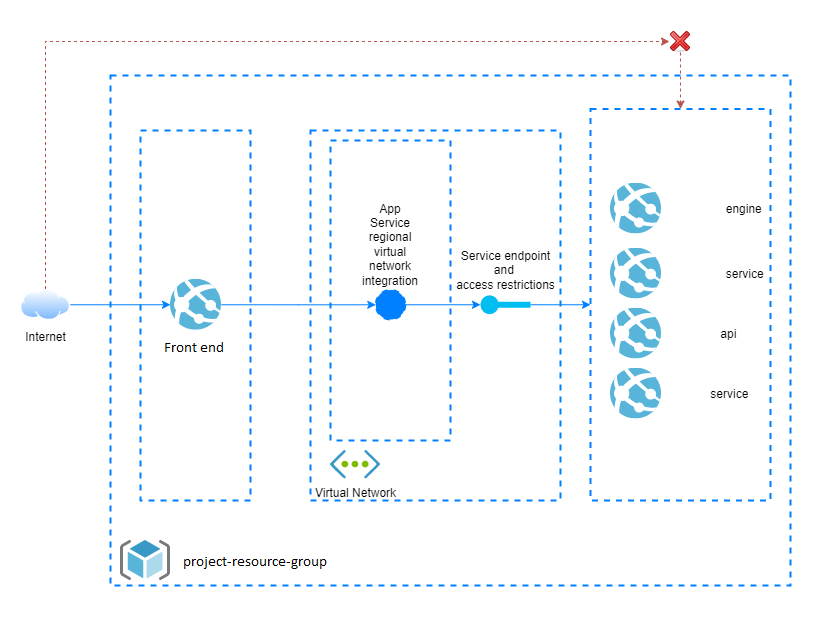

# Build status for Project infrastructure
[](https://domain.com)

# How to add yourself to Key Vault Access policies using IaC approach

First check your Object Id in Volue tenat Azure Active Directory in [Azure Portal](https://portal.azure.com/#view/Microsoft_AAD_UsersAndTenants/UserManagementMenuBlade/~/AllUsers) Or use az cli:
```
az ad signed-in-user show --query objectId -o tsv
```

Then fill in this code block and paste into **keyVault.bicep**
```bicep
{
    objectId: '{Object Id}' //email of the persons Object Id
    tenantId: tenant().tenantId
    permissions: {
        certificates: []
        keys: []
        secrets: [
        'all'
        ]
        storage: []
    }
}
```


# How to add your WAN IP address to access Project backend services Storage, Key Vault and App Services

First of all check your IP address with a service such as https://canyouseeme.org/.

Then fill in this code block and paste into **main.parameters.{env}.json** into allowedIPs parameter:
** priority 10 more than last priority on the list **
```json
    {
        "ipAddress": "{your IP address}/32",
        "priority": "170",
        "name": "Allow{your Name}"
    },
```

# Environments - [link to separate document](https://link.com)

# Current workflow


# Local deployment commands
Local deployment
az deployment group create --template-file main.bicep --parameters main.parameters.dev.json --mode Complete

Additional parameters
--parameters environmentName=Development location=northeurope

# Infrastructure overview
## First version


## Second version


## Third version


## Fourth version


# Service endpoints setup overview


# How to manually add service principal for Project CI/CD pipelines?

[Configure a service principal with a secret](https://github.com/Azure/login#configure-deployment-credentials)

For using any credentials like Azure Service Principal, Publish Profile etc add them as secrets in the GitHub repository and then use them in the workflow.
Prefer Service Principal as it gives more flexibility.

Follow the steps to configure Azure Service Principal with a secret:

Define a new secret under your repository settings, Add secret menu
Store the output of the az ad sp create-for-rbac az cli command as the value of secret variable, for example 'AZURE_CREDENTIALS'

```powershell
az account set --name "Department - Project - Dev"
az ad sp create-for-rbac --name "Project-GitHubActionsPipelines-Dev" --role contributor `
                            --scopes /subscriptions/5d263245-7bea-414e-89f1-85e331333418 `
                            --sdk-auth --years 1
```
